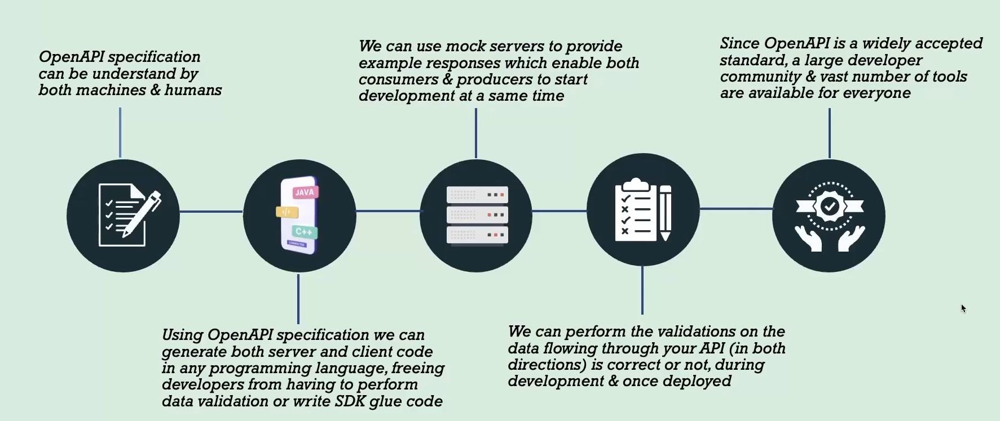
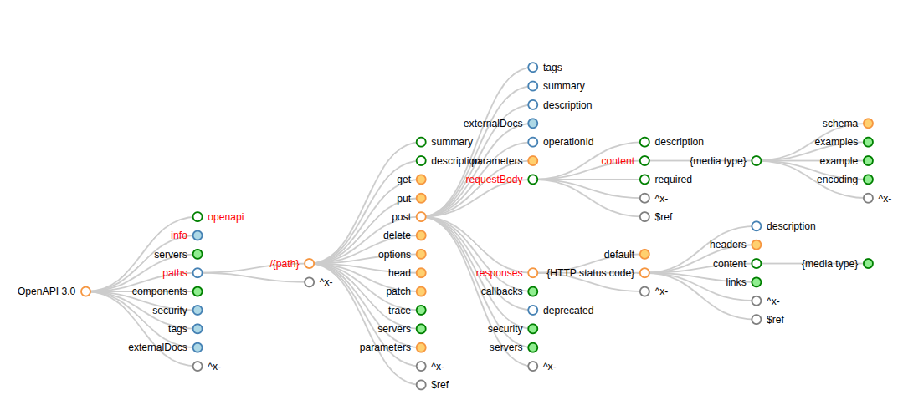

# OpenAPI

## Teminology

### Api (Application Programming Interface)

- An API is a set of rules and protocols for building and interacting with software applications.
- Also called a "contract" between different software components, allowing them to communicate with each other

### URL vs URI

- **URL (Uniform Resource Locator)**: A URL is a specific type of URI that provides the means to locate a resource on the internet by specifying its location (address) and the protocol used to access it (e.g., HTTP, HTTPS). For example, `https://www.example.com/path/to/resource`.

- **URI (Uniform Resource Identifier)**: A URI is a broader term that encompasses both URLs and URNs (Uniform Resource Names). A URI is a string of characters used to identify a resource, which can be either by location, name, or both. For example, `urn:isbn:0451450523` is a URN that identifies a book by its ISBN.

### OpenAPI

- 🛑 primarily designed for describing HTTP APIs
- OpenAPI is a specification which describe API supposed to do.

  - What endpoints an API has
  - What methods they use (GET, POST, etc.)
  - What parameters they take
  - What they return (responses)
  - How errors are handled
  - Authentication methods (like API keys or OAuth)

- The description is usually written in JSON or YAML.

#### Advantages of OpenAPI

- Tools can automatically generate server-side stubs (controller skeletons, routers).
- Tools can also generate client SDKs (Java, JS, C#, Python, Go, etc.).
- Automatically create fake endpoints. So the frontend team can start working before the backend is ready.
- We can perform validations on the data flowing through your API

  During development

  - Whether responses match the schema
  - Whether incoming data is correct
  - Whether contracts between services match

  After deployment

  - API gateways can validate requests & responses in real time
  - CI/CD can run contract tests automatically

#### OpenAPI vs Swagger

- **OpenAPI**: OpenAPI is a specification for building APIs. It defines a standard way to describe RESTful APIs.
- **Swagger**: Swagger is a set of tools built around the OpenAPI Specification.

## Swagger Tools

### Swagger Editor

- An open-source tool that allows you to design, document, and visualize OpenAPI specifications in a web-based interface.

### Swagger UI

- An open-source tool that generates interactive API documentation from OpenAPI specifications, allowing users to explore and test API endpoints directly from the documentation.

### Swagger Codegen

- A tool that generates client libraries, server stubs, API documentation, and configuration automatically based on an OpenAPI Specification.

### SwaggerHub

- A cloud-based platform that provides a collaborative environment for designing, documenting, and managing APIs using OpenAPI specifications. It integrates various Swagger tools and offers features for team collaboration, versioning, and hosting API documentation.

### Swagger Explore

- a free API client that allows users to interact with and test APIs, including REST and event-driven services like Kafka. Can generate OpenAPI specs from existing http APIs.

## Openapi structure

- https://openapi-map.apihandyman.io/
