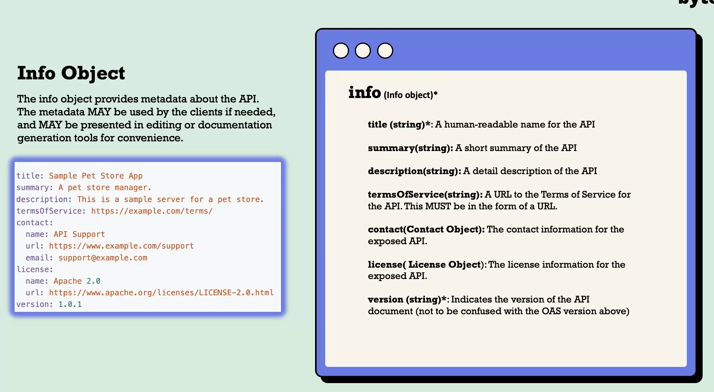
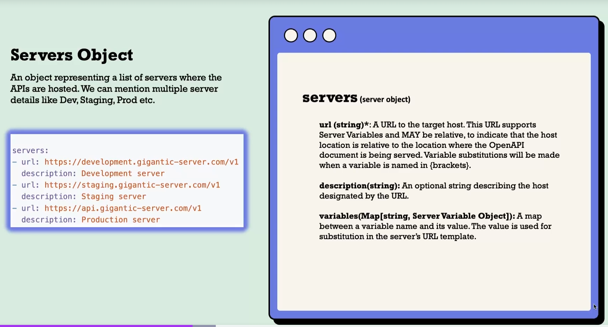

# Open API and Design First Approach

## Minimum open api specification

```yaml
openapi: 3.0.4
info:
  title: Portfolio
  version: 1.0.0
paths: {}
```

- openapi: Specifies the OpenAPI version being used.
- info: Contains metadata about the API, including title and version.
- paths: An object that will hold the available paths and operations for the API. In this case, it's currently empty ({}), indicating that no paths have been defined yet.

## Structure

### info



### Servers



#### variables

```yaml
servers:
  - url: https://{environment}.gigantic-server.com/v1
    description: Dynamic server based on environment
    variables:
      environment:
        default: development
        enum:
          - development
          - staging
          - api
        description: Environment for the API
```
