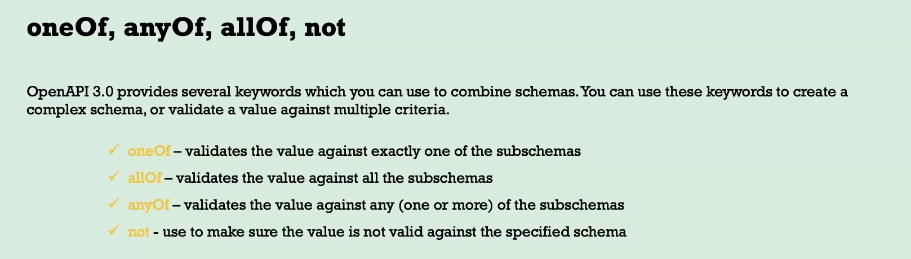
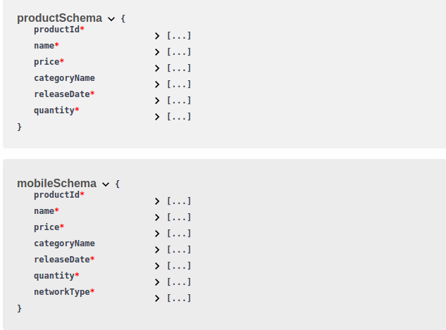
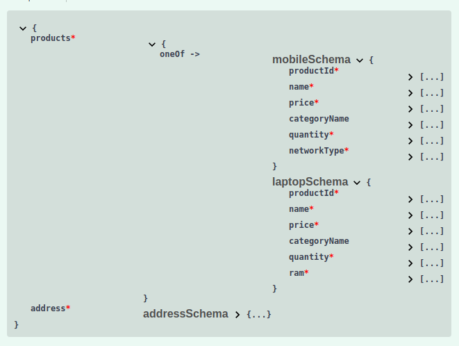
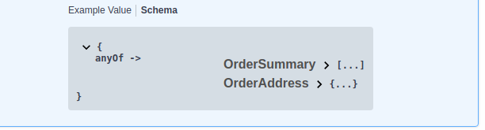

# Inheritance and Polymorphism



## Inheritance using allOf

- In OpenAPI, inheritance can be modeled using the `allOf` keyword.
- This allows you to create a base schema and then extend it with additional properties in derived schemas.

```yaml
productSchema:
      type: object
      properties:
        productId:
          type: integer
        name:
          type: string
        price:
          type: number
          format: float
        categoryName:
          type: string
          nullable: true
        releaseDate:
          type: string
          format: date
          readOnly: true
        quantity:
          type: integer
          description: |
            ***Quantity*** refer to the stock quantity
            <u> Not the quantity of an order by a customer </u>
      required:
        - productId
        - name
        - price
        - releaseDate
        - quantity
    mobileSchema:
      allOf:
        - $ref: "#/components/schemas/productSchema"
      type: object
      properties:
        networkType:
          type: string
          enum:
            - 4G
            - 5G
      required:
        - networkType
```



## Polymorphism using oneOf

- Polymorphism can be achieved using the `oneOf` keyword in OpenAPI.

```yaml
/oneOfOrder:
  post:
    tags:
      - Orders
    summary: Insert OneOf the Order Details
    description: Insert OneOf the Order Details into Eazyshop
    requestBody:
      content:
        application/json:
          schema:
            type: object
            properties:
              products:
                type: object
                oneOf:
                  - $ref: "#/components/schemas/mobileSchema"
                  - $ref: "#/components/schemas/laptopSchema"
              address:
                $ref: "#/components/schemas/addressSchema"
            required:
              - products
              - address
    responses:
      "200":
        description: Order placed successfully
```



## Polymorphism using anyOf

- Polymorphism can also be achieved using the `anyOf` keyword in OpenAPI.

```yaml
/anyOfOrder:
  get:
    tags:
      - Orders
    summary: Get Order Details
    description: Get Order Details based on Order ID
    parameters:
      - $ref: "#/components/parameters/orderIdQueryParam"
      - name: fetchType
        in: query
        required: true
        schema:
          type: string
          enum:
            - summary
            - details
        description: >
          Fetch Type:
          * `summary` - Will provide Order Summary
          * `details` - Will provide Order Summary & Order Address

    responses:
      "200":
        description: Return product details
        content:
          application/json:
            schema:
              anyOf:
                - $ref: "#/components/schemas/OrderSummary"
                - $ref: "#/components/schemas/OrderAddress"
```


